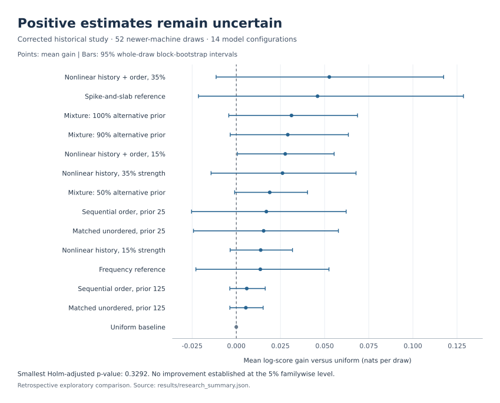

# Mark Six: probabilistic modeling and model validation

Forecasting Mark Six draws (Hong Kong's 6-of-49 lottery): unordered sets of six distinct numbers from 49, using sparse Bayesian models and chronological evaluation against a uniform baseline.

The implementation covers exact set probabilities, inclusion marginals, online model averaging, regime resets, and uncertainty estimates. The included example uses synthetic fair draws. A separate historical comparison covers 16 model configurations over 1,075 draws; it did not establish a predictive edge.

## Run

Requires Python 3.10 or newer.

```sh
python3 -m venv .venv
source .venv/bin/activate
python3 -m pip install -e '.[test]'
python3 -m pytest
python3 -m marksix demo --output results/my-run
```

The default example generates 240 independent fair draws with seed `20260914` and scores the last 180 after a 60-draw warmup. The [reference input](results/demo/synthetic_draws.csv) uses artificial daily dates starting on 4 July 2002, the first 6-of-49 draw date. Each run saves the input checksum, source hashes, package versions, model settings, summary statistics, and per-draw scores. Demo runs also save their generated input. Existing output directories are rejected.


The [reference summary](results/demo/summary.json) and [scores](results/demo/scores.csv) contain the plotted values. On fair draws no model can beat the uniform baseline in expectation, so the slightly negative totals here are the expected control result. `tests/test_evaluation.py` checks that the same evaluator detects a planted ball drawn 30% of the time instead of 6/49, and that fair draws produce no significant result.

Evaluate another CSV:

```sh
python3 -m marksix evaluate --input path/to/draws.csv --output results/custom --warmup 60
```

Required columns are `date`, `draw_id`, and `n1` through `n6`. Every row must have the same number of fields as the header. Dates must be unique, strictly increasing `YYYY-MM-DD` values on or after **4 July 2002**, when Mark Six moved from 47 to 49 numbers; earlier draws cannot be scored against this null, and a reset does not make them valid. IDs must be nonempty and unique. Each outcome must contain six distinct integers from 1 to 49. An optional populated `extra` column must contain a seventh distinct number; it does not enter the main-set forecast score.

Known machine changes on **9 November 2010** and **5 May 2026** automatically clear training history and mixture weights at the first available draw on or after each boundary. `--reset-date YYYY-MM-DD` adds another predetermined boundary and can be repeated; it cannot disable those resets. Old-machine observations never train new-machine effects. Resets mark machine generations: draws completed on a same-model backup machine after a live fault, such as 14/108 (20 September 2014) and 26/099 (12 September 2026), stay within their generation. Warmup applies once, at the beginning of the dataset. A reset can therefore produce a forecast from the prior alone. The synthetic demo's dates are artificial, so it applies only `--reset-date` boundaries.

This CLI is a research evaluator and does not authorize a bet. Operational use requires **expected gross payout strictly greater than HK$10 for every full HK$10 line**, under a normalized forecast and stated, verified pre-draw payout inputs. Equality does not qualify. Number predictions must not depend on player popularity, ticket sales, or jackpot size; monetary valuation follows prediction and uses identical sharing assumptions for every combination. No physical chamber or ball measurements are supplied by these statistical models.

The machine replacement is confirmed by [HKJC's April 2026 announcement](https://corporate.hkjc.com/en-US/news-and-publications/corporate-news/2026-04/news_2026042101511). The stored historical aggregates below predate this stricter isolation policy and have not been recomputed under it.

## Models

| Model | Method |
|---|---|
| `uniform` | Equal probability for each of the 13,983,816 six-number sets. |
| `sparse_single_ball` | Bayesian averaging over a uniform null and 49 mutually exclusive single-ball bias hypotheses. |
| `spike_slab` | Per-ball shrinkage toward the fair inclusion probability, with a sparse alternative prior. |
| `online_mixture` | Arithmetic probability mixture of the three models above, weighted by earlier scores. |

The beta alternatives are centered at `6/49` with concentration 20. The single-ball model splits prior mass equally between the uniform null and all alternatives together. The spike-and-slab prior assigns bias probability `1/49` to each ball. These are fixed statistical assumptions, not measured physical properties.

Propensities are clipped to `[0.015, 0.60]` and converted to log odds `z`. Each component is then evaluated as a conditional-Poisson distribution:

```text
P(S | z) = exp(sum(z[i] for i in S)) / Z(z),  |S| = 6
Z(z) = sum over six-element sets A of exp(sum(z[i] for i in A))
```

Dynamic programming computes the normalizer and marginals in log space. Marginals sum to six. Conditioning on set size changes the input propensity moments: this conversion is a projection. The spike-and-slab updates also use a composite approximation because ball indicators within a draw are dependent.

The mixture starts with weights `[0.5, 0.25, 0.25]`. It combines component probabilities, then updates weights **after** scoring the outcome, with learning rate `0.25` and a `1%` blend back to the initial prior. Per-draw score differences are small, so the blend keeps the weights close to the prior: a steady edge of 0.024 nats per draw, what an oracle gains from one ball drawn 20% of the time, still leaves the uniform weight near 0.36. All component forecasts use preceding draws only.

## Evaluation

Log-score gain is `log P_model(observed set) - log P_uniform(observed set)`, measured in nats. Positive gain means a better score on the evaluated outcomes; it is not a cash return. Brier gain measures reduction in mean squared error across the 49 inclusion probabilities.

The evaluator uses 2,000 circular block-bootstrap resamples with eight-draw blocks. Entire draws are resampled together across models. Percentile confidence intervals describe mean gain per draw. One-sided p-values use the centered bootstrap distribution, so for skewed gains an interval can exclude zero while p stays above 0.025, or the reverse. Holm adjustment covers the three nonuniform forecasts. For fewer than 32 evaluated draws, nonbaseline confidence intervals and p-values are omitted.

Chronological fitting prevents target leakage within an evaluation. It does not correct model selection informed by the evaluation period. Bootstrap summaries also depend on assumptions about temporal dependence and stationarity, especially around regime changes.

## Historical comparison

The [historical aggregate results](results/research_summary.json) cover 843 development draws, 180 subsequent old-machine draws, and 52 newer-machine draws through 10 September 2026. The last period begins on 5 May 2026. All outcomes were available before this model round was designed, so this comparison is retrospective.



The strongest newer-machine point estimate was the spike-and-slab reference (`spike_slab_five_balls` in the aggregate file, a configuration from the broader suite rather than the `spike_slab` settings above): **+2.392 total nats**, or **+0.0460 nats per draw**, with a 95% mean interval of **[-0.0214, +0.1286]**. Every nonuniform newer-machine interval includes zero, and all corresponding Holm-adjusted p-values are 1.00. The historical intervals use 3,000 circular block resamples, with five-draw blocks for windows below 100 draws and 20 otherwise. Corrections cover the 15 nonuniform models within each period, not the complete earlier exploratory search.

These aggregates use a broader experimental suite and historical inputs that are not included here. The four-model synthetic example does not reproduce that study. The aggregate file records its source checksum and unrounded metrics. Statistical fit alone does not identify a physical mechanism, and the results remain inconclusive.

## Figures and source

Regenerate both figures from saved results:

```sh
python3 -m pip install -e '.[plots]'
python3 scripts/render_figures.py
```

`tests/test_results.py` fails when the reference run no longer matches the current code, including its recorded source hashes. After changing `src/marksix`, regenerate it before the figures:

```sh
rm -r results/demo
python3 -m marksix demo --output results/demo
```

Keep private inputs in `data/` or `private/`. Git ignores those folders, dataset files such as `*.csv` and `*.xlsx`, and everything under `results/` except the published files listed above.

```text
src/marksix/       Probability models, input validation, evaluation, and CLI
tests/            Probability identities, numerical checks, and leakage tests
scripts/          Figure generation
results/          Synthetic reference run and historical aggregates
```
